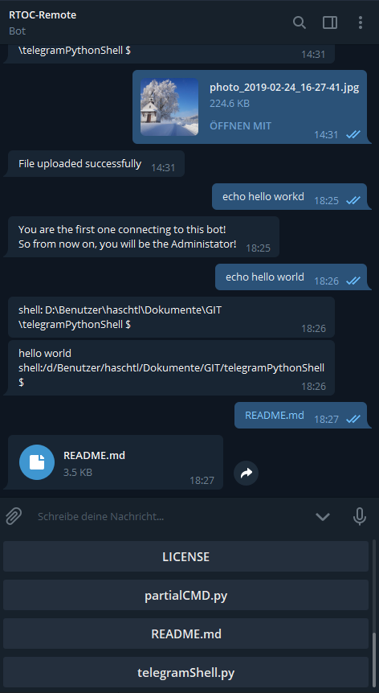

# TelegramRemoteShell
### v2.0
Do you need a simple solution to get remote access to your linux or windows pc/server?
Then you can try my telegramBot with shell support and file up- and download!

## Features
- Access your Linux or Windows Shell from everywhere without dynDNS or Portforwarding!
- Full filebrowser including file download and upload
- Use most Shell-commands remotly in telegram.
- Only interactive shell-commands like nano will not work and can be blacklisted.
- Define your own shortlinks for quick access for often used commands
- Compatible with Linux and Windows!
- Security: The first client conneced with the telegram bot has automatically access. For every client connecting afterwards you must add the chat_id to the "clients.json" file.

## Requirements
- Linux or Windows system
- Smartphone with Telegram App (or Telegram Desktop)
- Python 3
- python-telegram-bot: https://github.com/python-telegram-bot/python-telegram-bot

  > pip3 install python-telegram-bot --upgrade

## Installation
- Chat with BotFather to create a Bot ( [https://telegram.me/botfather](https://telegram.me/botfather) ), just launch the command /newbot to get your Telegram Token.
Open the bot chat and send some messages to activate the bot.
- Clone this repository
  > cd ~ & git clone https://git.kellerbase.de/haschtl/telegramRemoteShell.git & cd telegramRemoteShell

- Enter the Bot-Token from Botfather in 'config.json' file.

- Start the Bot in telegram and execute Skript with
  > python3 telegramShell.py

- Send your first Shell-Command (for example, type: 'echo hello world'). Enjoy!

## Default commands
- /help and /start: Show the Help-dialog
- /shortcuts: Shows the telegram-menu with all shortlinks defined in config.json

## config.json
You can configure shortlinks for specific Shell-commands/scripts in the config.json file. These will be shown on '/shortcuts' command and in the telegram-menu.

Just enter name, info and the executed command in the 'commands' dict of 'config.json' like this:
~~~~
"commands": {
      "example1": {"info": "This is an example", "execute":"echo mybashscript"},
      ...
    }
~~~~

For more information, have a look at example_config.json

## Autostart

Create a new service-file:
> sudo nano /etc/systemd/system/telegramShell.service

and copy the following content: (edit the "ExecStart" to your path)
IMPORTANT: If "User=root" is set, the telegram bot will have root permissions always! If you don't want that, change the user to your username!
~~~~
# /etc/systemd/system/telegramShell.service

[Unit]
Description=TelegramShell
After=network.target
#After=gpsd.service

[Service]
Type=simple
User=root
ExecStart=/path/to/telegramShell.py
Restart=on-failure

[Install]
WantedBy=multi-user.target
~~~~

make telegramShell executable
> chmod +x telegramBot.py

Enable and start your configured service:
> sudo systemctl enable telegramShell
> sudo systemctl start telegramShell

Now check if the telegramShell is running with:
> sudo systemctl status telegramShell
or
> sudo journalctl telegramShell

The last line should be
> Telegram-Server successfully started!

### partialCMD

If you want only a specific part of a long Command-Output, you can use this Pre-command:
> partialCMD "Command" "BEGIN" "END"

It will return the Command-Output between the Strings BEGIN and END.
Example:
> partialCMD "echo hello && echo world && echo haus" "world" "haus"
>
> -> world

Normally it would return
> hello
>
> world
>
> haus

You can also put this in the config.ini:
> command: 'partialCMD "echo hello && echo world && echo haus" "world" "haus"'

### Known Bugs
- Interactive shell-commands like 'python' are not working. The telegram bot will hang until you restart it.
