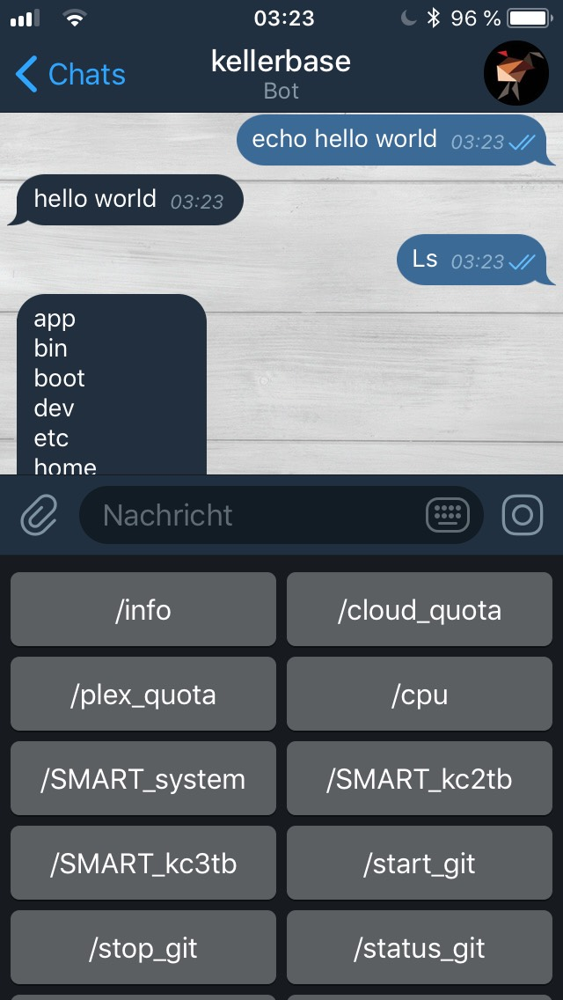

# telegramRemoteShell
A configurable Remote-shell in telegram for Linux and Windows.  
No need for dynamicDNS and portforwarding!

# Requirements
- Linux or Windows system
- Smartphone with Telegram App (or Telegram Desktop)
- Python 3 
- python-telegram-bot: https://github.com/python-telegram-bot/python-telegram-bot

  > pip install python-telegram-bot --upgrade 

# Installation
- Chat with BotFather to create a Bot ( [https://telegram.me/botfather](https://telegram.me/botfather) ), just launch the command /newbot to get your Telegram Token.  
Open the bot chat and send some messages to activate the bot.
- Clone this repository
  > cd ~ & git clone https://github.com/Haschtl/telegramRemoteShell.git & cd telegramRemoteShell

- Enter the Bot-Token from Botfather in 'config.ini' file.

- Start the Bot in telegram and execute Skript with 
  > python3 telegramShell.py

- Send your first Shell-Command (for example, type: 'echo hello world'). Enjoy!

# Default commands
- /help and /start: Show the Help-dialog
- /menu: Shows the telegram-menu with all shortlinks defined in config.ini

# config.ini
You can configure shortlinks for specific Shell-commands/scripts in the config.ini file. These will be shown on '/help' command and in the telegram-menu.

Just enter name, info and the command in the 'COMMANDS:' section of 'config.ini'.

#### example:
> COMMANDS:
>
> name: 'info' 
>
> info: 'Disk usage'
>
> command: 'sudo df -a | grep -m5 ""'
>
>...

For more information, have a look at config_example.ini

# Autostart

Edit rc.local with
> sudo nano /etc/rc.local

Add line
> python3 /pathTo/telegramShell.py &

before 'exit 0

Restart rc.local service with
> sudo service rc.local restart

If telegramShell crashed, you need to stop it manually.
> ps aux | grep python
>
> sudo kill 'process_id'
>
> sudo service rc.local restart

### Known Bugs
- 'll' command not working
- Interactive shell-commands like 'python' are not working

